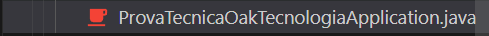
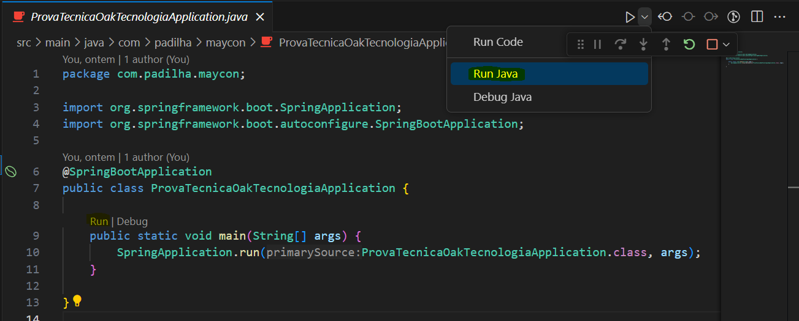

# Instruções para Executar o Projeto

Para rodar o projeto, siga as seguintes etapas:

# Passo 1: Arquivo Main

Acesse o arquivo "ProvaTecnicaOakTecnologiaApplication.java".

# Passo 2: Opções de Execução

Você pode executar o projeto de duas maneiras:

Opção 1: Botão "Run Java" (destaque amarelo)

Clique no ícone de play localizado no canto superior esquerdo e, em seguida, selecione a opção "Run Java".

Opção 2: Botão "Run" (destaque amarelo)

Também é possível rodar o projeto clicando no botão "Run" acima da classe principal dentro do arquivo Java.

Acesso ao Sistema

Após a execução bem-sucedida, o sistema será iniciado e você poderá acessá-lo pelo seguinte link no seu navegador: http://localhost:8080/

Siga essas instruções para iniciar o projeto e começar a utilizá-lo. Se surgirem problemas ou dúvidas, entre em contato comigo!.
